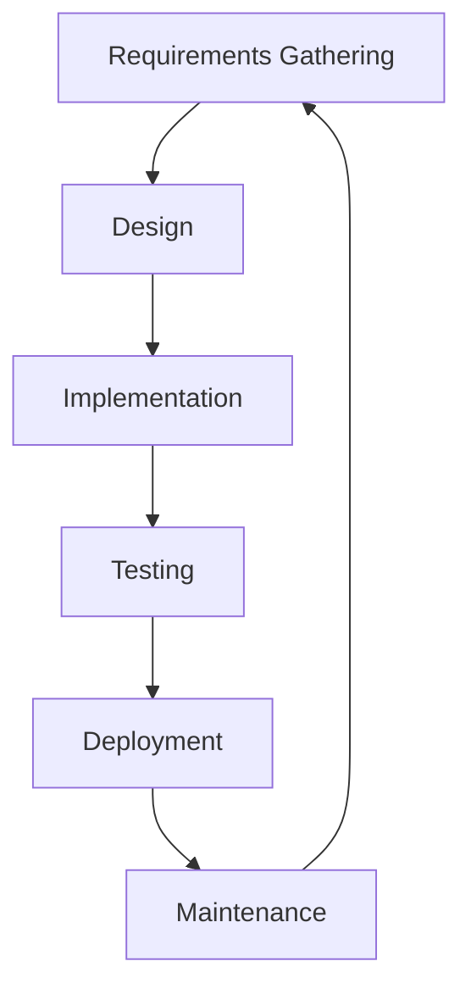
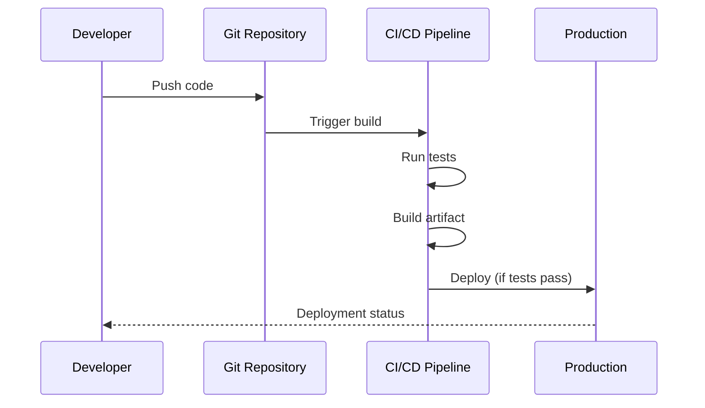

## Understanding Software Development Lifecycle

The Software Development Lifecycle (SDLC) is a structured process that guides the development of software applications from conception to deployment and maintenance.

## SDLC Phases

Here's a visual representation of the typical SDLC phases:

## Key Phases Explained

### Requirements Gathering
Understanding what the software needs to accomplish. This involves working with stakeholders to define features, constraints, and goals.

### Design
Creating the architecture and detailed design of the system. This includes database schemas, API designs, and user interface mockups.

### Implementation
Writing the actual code based on the design specifications. This is where developers bring the design to life.

### Testing
Verifying that the software works as expected. This includes unit tests, integration tests, and user acceptance testing.

### Deployment
Releasing the software to production where users can access it. This may involve continuous integration and deployment pipelines.

### Maintenance
Ongoing support, bug fixes, and updates to keep the software running smoothly and meeting evolving needs.

## Workflow Example

Here's an example of a typical development workflow:

## Best Practices

- **Automate testing** - Catch bugs early with automated test suites
- **Use version control** - Track changes and collaborate effectively with Git
- **Implement CI/CD** - Automate builds and deployments for faster delivery
- **Document your code** - Make it easier for others (and future you) to understand
- **Review code** - Catch issues and share knowledge through code reviews

Following a structured SDLC ensures that software is developed systematically, with quality and maintainability in mind.
