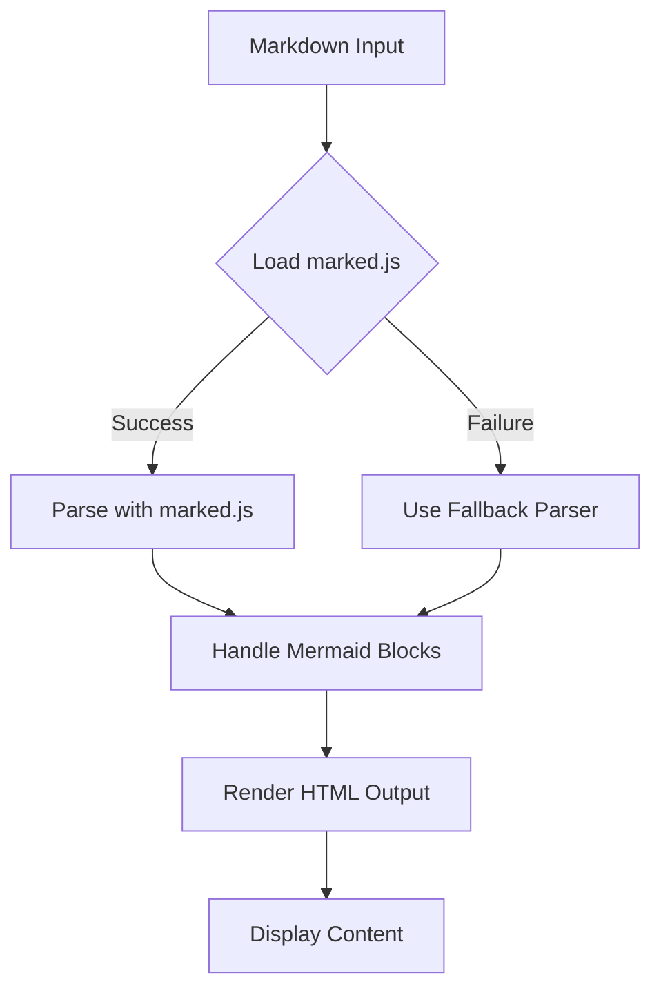

## Testing Enhanced Markdown Parser

This post demonstrates the newly added markdown features including ordered lists and tables.

## Ordered Lists

Here's an example of an ordered list:

1. First item
2. Second item
3. Third item
   1. Nested item 3.1
   2. Nested item 3.2
4. Fourth item

## Unordered Lists

For comparison, here's an unordered list:

- Item one
- Item two
- Item three
  - Nested item
  - Another nested item

## Tables

Here's a table showing programming languages and their characteristics:

| Language   | Type       | Performance | Difficulty |
|-----------|-----------|-------------|------------|
| JavaScript | Dynamic   | Medium      | Easy       |
| Python     | Dynamic   | Medium      | Easy       |
| Java       | Static    | High        | Medium     |
| C++        | Static    | Very High   | Hard       |
| Go         | Static    | High        | Medium     |

### Another Table Example

| Feature        | Supported | Notes                    |
|---------------|-----------|--------------------------|
| Headers       | ✓         | H1, H2, H3, etc.        |
| Bold/Italic   | ✓         | **bold** and *italic*   |
| Links         | ✓         | [text](url)             |
| Code blocks   | ✓         | With syntax highlighting|
| Ordered lists | ✓         | 1. 2. 3. etc.           |
| Tables        | ✓         | GitHub-flavored markdown|
| Mermaid       | ✓         | Diagram support         |

## Code Example

Here's a code example demonstrating table generation:

```javascript
function generateTable(data) {
    const headers = Object.keys(data[0]);
    let table = '| ' + headers.join(' | ') + ' |\n';
    table += '|' + headers.map(() => '---').join('|') + '|\n';
    
    data.forEach(row => {
        table += '| ' + headers.map(h => row[h]).join(' | ') + ' |\n';
    });
    
    return table;
}
```

## Mermaid Diagram

Here's a flowchart showing how the enhanced parser works:



## Mixed Content

You can combine different elements:

1. **First point**: Tables are now supported
2. **Second point**: Ordered lists work correctly
3. **Third point**: Mermaid diagrams continue to work

## Conclusion

The enhanced markdown parser now provides comprehensive support for:

- ✓ Ordered lists (1, 2, 3...)
- ✓ Unordered lists (-, *, +)
- ✓ Tables with alignment
- ✓ Code blocks with syntax highlighting
- ✓ Mermaid diagrams
- ✓ All standard markdown features (bold, italic, links, headers, etc.)
