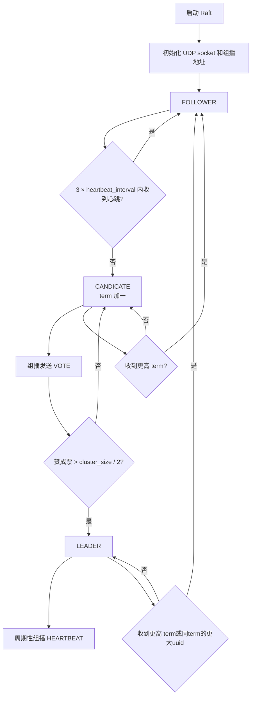
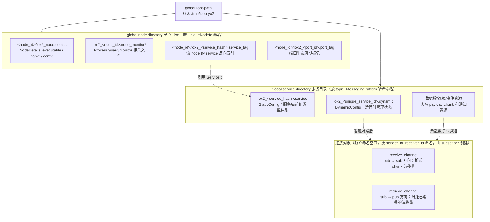
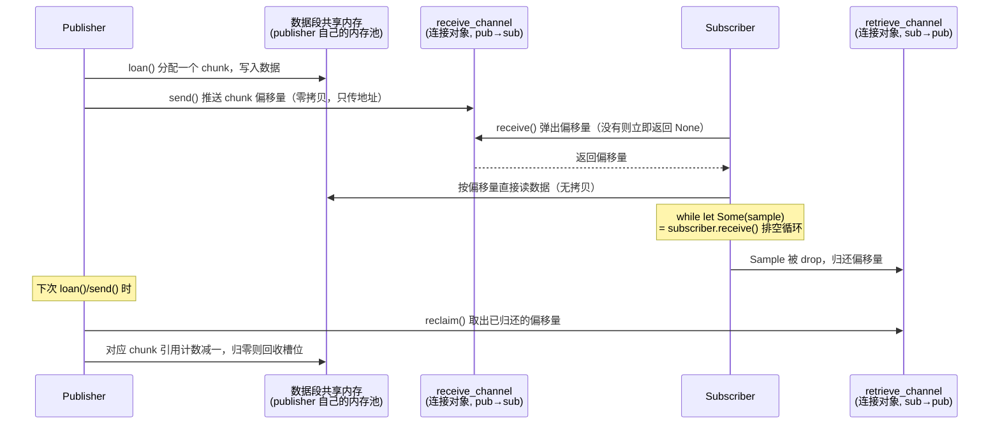
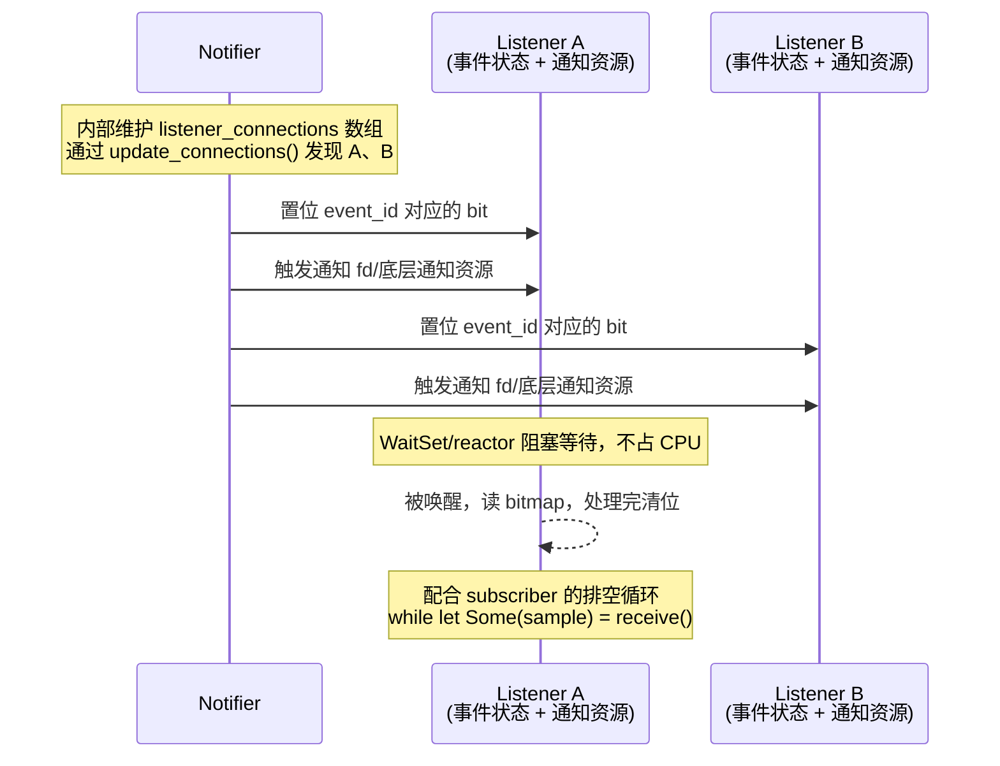

[TOC]
# 基于服务发现的通信中间件

服务端可以通过 `topic/message_pattern` 注册服务，客户端可以通过相同的键发现服务并订阅。这样就不需要提前约定端到端的通信地址，服务端和客户端都可以动态加入和退出。服务发现的核心是维护一份注册表。

## 中心化的服务发现

最直接的方式是通过中心节点实现服务发现。中心节点维护服务注册表，服务端启动时注册自己的服务信息，客户端启动时查询服务地址。注册信息通常还需要配合心跳或 TTL，避免服务退出后注册表中长期保留失效地址。

这种方式实现简单，服务注册和查询的职责也比较清晰，但中心节点本身成为系统的关键依赖。中心节点故障时，服务端无法注册，客户端也无法发现新的服务；因此还需要为中心节点提供高可用部署、故障转移和数据持久化能力。

## 去中心化的服务发现

去中心化服务发现的目标是消除单个注册中心节点的单点故障。实际系统通常由多个节点组成一个一致性集群.

### etcd

etcd 是一个强一致性的分布式键值存储，也可以用作服务注册中心。服务实例可以申请带 TTL 的 lease，将自己的服务地址写入与 lease 关联的键，并在进程存活期间持续续约；lease 过期后，关联的键会被删除。客户端可以通过 watch 监听某个键或前缀的变化，从而在服务上线、下线或地址变化时更新本地缓存，而不必持续轮询。

etcd 使用 Raft 同时完成 leader 选举和日志复制，注册表数据会在集群成员之间复制。需要达成共识的更新必须由多数成员确认，因此集群失去多数派时不能继续提交新的写入。客户端通过配置的 etcd 成员地址访问集群，不需要使用组播，也不需要另外实现集群间的注册表同步。需要注意的是，lease 只能反映服务实例仍能续约，不能替代应用层的健康检查。

### BestUO::Raft

[BestUO::Raft](https://github.com/BestUO/littletools/tree/master/tools/raft) 单独实现了raft算法的核心功能：选举。它只处理 `HEARTBEAT`、`VOTE` 和 `VOTERESPONSE` 三类实际会被 `HandleData()` 分发的消息.

节点通过 UDP 组播通信，默认组播地址为 `234.56.78.90:9987`。每个节点创建一个临时端口的普通 UDP socket 用于发送，同时创建一个开启地址复用的组播 socket 接收消息；节点之间不维护单独的 peer 地址列表。节点状态包括 `FOLLOWER`、代码中拼写为 `CANDICATE` 的候选者，以及 `LEADER`。心跳超时后，节点增加 term、切换为候选者并通过组播发送投票请求；收到超过 `cluster_size / 2` 的同 term 赞成票后成为 leader，并按 heartbeat interval 周期发送心跳。



实现中的选举超时是 `3 * heartbeat_interval`，第一次检查还会增加 `0` 到 `99` 毫秒的随机值，之后的定时周期是固定的。默认 heartbeat interval 为 500 毫秒，而测试用例配置的是 100 毫秒，10个节点同时启动可在500ms内选出一个leader节点。集群总大小来自静态配置的 `cluster_size`，不是通过成员发现动态计算的。

该实现还包含一项自定义的冲突处理：同一 term 下两个节点都认为自己是 leader 时，通过比较 UUID 让较大的 UUID 保留 leader 角色用以加快选举过程。集成节点启动网络事件循环和 `Raft` 后，可以通过 `Raft::GetRole()` 判断自身角色，再决定是否响应服务注册与发现请求。

### iceoryx2
#### 目录结构
```
tree /dev/shm /tmp/iceoryx2/
/dev/shm
├── iox2_0354a209029e7d094a819e2d4030ea331e6caaf0_167669731193451374734757469259.data
├── iox2_305ad9523c6b202364d581359ec3d2c5743e42e7_88296412615130078134054034507.dynamic
├── iox2_9204dd183d1c4d8e1ff592a30766ffa6765aa8b5_node.0_9_999.global_mgmt
└── iox2_b9fc73e5c1f646968758453273c6c65cb372831b_167669731193451374734757469259_174204583234706370817156062600.connection
/tmp/iceoryx2/
├── nodes
│   ├── 2597821165922259659259324247710795
│   │   ├── iox2_167669731193451374734757469259.port_tag
│   │   ├── iox2_4eacadf2695a3f4b2eb95485759246ce1a2aa906.service_tag
│   │   └── iox2_node.details
│   ├── 2597906899854434788489543204085128
│   │   ├── iox2_174204583234706370817156062600.port_tag
│   │   ├── iox2_4eacadf2695a3f4b2eb95485759246ce1a2aa906.service_tag
│   │   └── iox2_node.details
│   ├── iox2_2597821165922259659259324247710795.node_monitor
│   ├── iox2_2597821165922259659259324247710795.node_monitor_context
│   ├── iox2_2597821165922259659259324247710795.node_monitor_owner_lock
│   ├── iox2_2597906899854434788489543204085128.node_monitor
│   ├── iox2_2597906899854434788489543204085128.node_monitor_context
│   └── iox2_2597906899854434788489543204085128.node_monitor_owner_lock
└── services
    └── iox2_4eacadf2695a3f4b2eb95485759246ce1a2aa906.service
```

* .global_mgmt: 
```rust
Data<State> {
    version: AtomicU64,  // PackageVersion::get().to_u64()
    data: State,
}
```

* iox2_node.details: 节点信息
* .node_monitor: 原进程持有的文件锁，生命周期和原node一致。只表征node存活状态
* .node_monitor_context: 存放unique_process_id，统一进程不同node的unique_process_id相同
* .node_monitor_owner_lock: 清理node资源的文件锁。谁拥有这个文件锁，谁就能清理原进程资源。只表征清理权
* .dynamic: 文件名由`iceoryx2::service::dynamic_config::DynamicConfig`+`UniqueSystemId`组成。第二个程序通过`.servive`文件查看`UniqueSystemId`，打开`.dynamic`文件，修改`DynamicConfig`数据，添加`nodes`和`messaging_pattern`信息。`service.publisher_builder().create()`时会把port_id加入到`messaging_pattern`对应的`PublishSubscribe`信息中。
```rust
pub(crate) enum MessagingPattern {
    RequestResponse(request_response::DynamicConfig),
    PublishSubscribe(publish_subscribe::DynamicConfig),
    Event(event::DynamicConfig),
    Blackboard(blackboard::DynamicConfig),
}
pub struct UniqueSystemId {
    pid: u32,
    seconds: u32,
    nanoseconds: u32,
    counter: u32,
}s
pub struct UniqueNodeId(pub(crate) UniqueSystemId);
pub struct Container<T: Copy + Debug> {
    // must be first member, otherwise the offset calculations fail
    element_generation_counter_ptr: RelocatablePointer<AtomicU64>,
    data_ptr: RelocatablePointer<UnsafeCell<MaybeUninit<T>>>,
    capacity: usize,
    change_counter: AtomicU64,
    is_initialized: AtomicBool,
    container_id: UniqueId,
    // must be the last member, since it is a relocatable container as well and then the offset
    // calculations would again fail
    index_set: RobustUniqueIndexSet,
}
pub struct DynamicConfig {
    messaging_pattern: MessagingPattern,
    nodes: Container<UniqueNodeId>,
}
```

* .service_tag:以`service_hash(messaging_pattern+service_name)`为文件名, 每个文件都标记node使用过的一个service，供死亡节点清理
* .service: `create_static_config_storage`创建，存储service相关基本信息
* .port_tag: 以`UniquePublisherId::new()`命名，标记一个连接。节点挂掉后，通过`prot_tag`文件名的`port_id`删除对应的`.data`文件
* .data: 文件名由 内部类型+`port_id`组成,真正存数据的地方
* .connect: 文件名由 内部类型+`sender_port_id_receiver_port_id`组成。`service.publisher_builder().create()`或`service.subscriber_builder().create()`时，检索`.dynamic`中的对端列表再执行`create_sender()`或者`create_receiver()`创建`.connect`。`.connect`存放`SharedManagementData`结构体,`channels`中维护发送队列和归还队列，send时发发送队列发offset,sub消费完向归还队列发消息。
```rust
pub struct SharedManagementData {
    channels: RelocatableVec<Channel>,
    segment_details: RelocatableVec<SegmentDetails>,
    state: AtomicU8,
    max_borrowed_samples: usize,
    number_of_samples_per_segment: usize,
    number_of_segments: u8,
    enable_safe_overflow: bool,
}
```

#### 服务发现

> 这里的 iceoryx2 章节讨论的是 iceoryx2 的本机/跨进程 IPC，不是基于 TCP/UDP 的网络分布式中间件。默认的 `ipc::Service` 使用 POSIX 相关机制和共享内存；`local::Service` 只限当前进程；`*_threadsafe::Service` 决定端口对象能否安全地在线程间共享。不同进程的节点通过文件、共享内存对象和文件描述符通知机制协作，不经过中心 daemon。



**Node 目录**(`global.node.directory`,全局唯一、按 `UniqueNodeId` 命名,和具体 service 无关):

- **节点详情**(`NodeDetails`):节点基本信息,包含 `executable`(可执行文件名)、`name`(用户节点名)、`config`(该节点使用的配置)。它由 `NodeBuilder::create()` 序列化到 `iox2_node.details`，不是 payload 共享内存。
- **文件监控锁**:由 `ProcessGuard` 创建 state/context/owner-lock 等文件，并对 state file 持有进程关联的写锁。进程崩溃时，操作系统关闭文件描述符并释放锁；文件本身不会自动删除。其他进程通过 `ProcessMonitor` 判断 `Alive`/`Dead`/`DoesNotExist`，而不是依赖 PID。`ProcessCleaner` 取得 owner lock 后才有权清理 dead node，避免多个进程同时清理。
- **service_tag/port_tag**:分别是 node 与 service、node 与 port 的生命周期标记。它们提供反向索引，使 dead-node cleanup 可以找到关联资源，而不必扫描所有服务。

**Service 目录**(`global.service.directory`,按 `服务名 + MessagingPattern` 哈希命名):

- **静态配置**:服务描述(类型信息、QoS/资源限制、`MessageTypeDetails` 等)。`open_or_create()` 的第一个成功创建者用 `O_CREAT|O_EXCL` 创建并写入，后来者打开并校验；它是初始化后只读的配置文件。
- **动态配置**:由 `DynamicStorage<DynamicConfig>` 提供的共享管理区域，保存节点注册、publisher/subscriber 或 notifier/listener 的运行时管理信息。它不是简单地“无锁并发读写”：内部包含原子状态、可重定位容器、分配器和具体同步策略；具体端口和 service 类型还会影响线程安全策略。
- **数据与连接资源**:`.service`/`.dynamic` 不是 payload 本身。publish-subscribe 的实际 chunk 位于数据段；sender/receiver connection 和 event/notification 资源负责传递偏移量、回收信息和唤醒等待者。

**初始化与并发创建**(不是把整个写入过程做成一个原子操作):

1. 创建阶段用 `O_CREAT | O_EXCL` 保证同一时刻只有一个进程能创建成功,解决"谁来写"的互斥问题。
2. 用初始化状态协议发布“可读取”:
   - 静态 storage 先以 `INIT_PERMISSIONS` 创建，写入内容并 `sync_all()` 后切换到 `FINAL_PERMISSIONS`。
   - file dynamic storage 先创建并 `truncate`/`mmap`，把 `Data<T>::version` 设为 0；initializer 完成后以 `SeqCst` 写入当前 package version，再切换到最终权限。
   - 打开方在权限仍是初始化状态、文件大小为 0、或 dynamic version 为 0 时等待；超时返回 `InitializationNotYetFinalized`。因此同步依靠“独占创建 + 完成标志 + 打开方等待”，不是依靠 `open`、`truncate`、`mmap`、业务写入本身的原子性。
3. 如果创建方在初始化中崩溃，monitor token 对应的 `ProcessGuard` 会因操作系统关闭文件描述符而释放锁；其他 node 通过 `ProcessMonitor` 发现 `Dead`，取得 `ProcessCleaner` 后清理 stale resources。`FINAL_PERMISSIONS` 只代表 storage 初始化完成，不代表进程存活。

**连接对象**(独立于 node/service 目录的第三类资源):

- pub/sub 场景下,每一对 (publisher, subscriber) 有独立的连接共享内存,内部紧挨着放 `receive_channel` + `retrieve_channel`,由 **subscriber(receiver)端创建**(因为容量取决于 subscriber 自己的 buffer 配置),按 `sender_id + receiver_id` 算出确定性名字,publisher 通过 `update_connections()` 发现新 subscriber 后去 open 这个已创建好的连接。

#### Publisher/Subscriber 模式(数据面，零拷贝 + 通知/轮询两种使用方式)


- publisher 往自己的数据段共享内存里写数据,把这个 chunk 的**偏移量**推进对应 subscriber 连接里的 `receive_channel`。
- subscriber 从 `receive_channel` 弹出偏移量,再去数据段里读实际数据;`subscriber.receive()` 是非阻塞的,没有数据立即返回 `None`。如果应用只在 `node.wait()` 后调用 `receive()`，就是周期性轮询；也可以把 Listener/通知 fd attach 到 `WaitSet`，由 epoll/select 等 reactor 唤醒后再排空 receive 队列。
- subscriber 用完一个样本(`Sample` 被 drop)后,把这个偏移量推进同一条连接的 `retrieve_channel`。
- publisher 在需要分配新 chunk 时(`loan`/`send` 内部)顺带处理 `retrieve_channel`:弹出偏移量,把对应 **chunk** 的引用计数减一,归零后这个**槽位**被回收复用——这是常规定长消息下的粒度,不涉及删除整个共享内存文件。

#### Notify/Listen 模式(控制面，事件状态 + 可等待通知)


- `EventId` 是应用双方提前约定好的整数,数值本身就是位图下标,不存在冲突问题,只要不超过建 service 时配置的 `event_id_max_value` 上限。
- Notifier 内部维护到已知 Listener 的连接，并向每个 Listener 的事件状态和通知资源发送通知。具体底层机制由 `Service::Event`/CAL backend 决定，不应在通用架构描述中固定为“每个 Listener 一张 bitmap + 一个 semaphore”。
- 如果使用 `WaitSet`，应用不需要自己维护 bitmap 或 semaphore：Listener/文件描述符被 attach 到 `Service::Reactor`，Linux 通常使用 epoll，其他 backend 可使用 select 等机制；WaitSet 通过 attachment id 回调应用。
- 通知只负责唤醒和报告事件状态，不等于替代数据面队列。publish-subscribe 收到唤醒后仍应排空 `subscriber.receive()`；具体事件是否合并、是否丢失以及事件语义由 Event/Listener 的实现和 API 契约决定，不能笼统保证“信号量计数 + bitmap 一定不会丢数据”。

#### WaitSet：统一等待多个事件源

`WaitSet` 是 reactor 封装，不是另一套消息队列。创建时建立 `Service::Reactor` 和 deadline queue；attach 时把 Listener 或实现 `FileDescriptorBased`/`SynchronousMultiplexing` 的对象注册到底层 reactor。Linux backend 使用 epoll，select backend 使用 `FileDescriptorSet`。

```rust
let waitset = WaitSetBuilder::new().create::<ipc::Service>()?;
let guard = waitset.attach_notification(&listener)?;

waitset.wait_and_process(|attachment_id| {
    if attachment_id.has_event_from(&guard) {
        let _ = listener.try_wait(|event| {
            // process event activation
            let _ = event;
        });
    }
    CallbackProgression::Continue
})?;
```

attachment 由 `WaitSetGuard` 持有，guard drop 时自动 detach。WaitSet 还支持 interval、deadline 和超时等待；deadline 到期与 fd 就绪分别生成不同的 attachment 状态。

#### 线程安全 service 类型

`ipc::Service` 和 `ipc_threadsafe::Service` 都使用跨进程 IPC 资源，区别在进程内端口对象的线程安全策略：前者使用 `SingleThreaded`，后者使用 `MutexProtected`，后者会增加锁开销但使端口可以安全地在线程间共享。`local`/`local_threadsafe` 是对应的进程内变体。

#### 可变长消息

- 底层通过 `ResizableSharedMemory` 支持:数据段不是单一固定大小的共享内存,而是由若干个按需追加的 segment(每个有自己的 `SegmentId`)拼成的池子。
- **绝大多数消息复用现有 segment**,只有当请求的大小超出当前所有 segment 的分配能力时,才会创建一个新的、更大的 segment,后续的大消息改从新 segment 分配。
- 旧 segment 在里面所有 chunk 都被回收之前不会被销毁;subscriber 收到指向"没见过的新 segment"的偏移量时,需要先额外 `mmap` 一次这个新 segment 才能读数据。
- 这套机制有次数上限(`SegmentId` 的取值范围是有限的),适合"消息大小阶段性变化但整体有界"的场景,不适合每条消息大小都剧烈抖动的场景。
