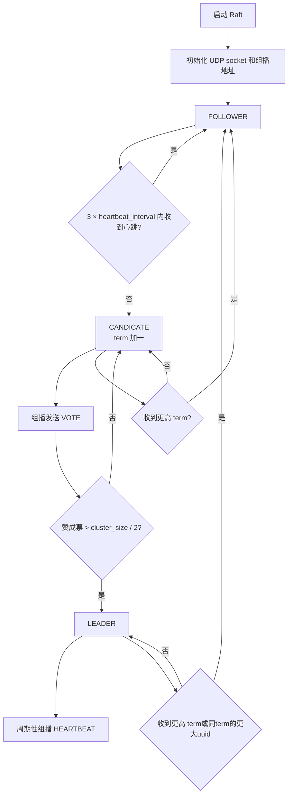
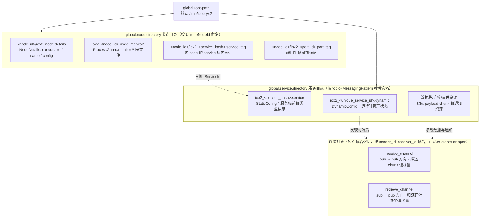
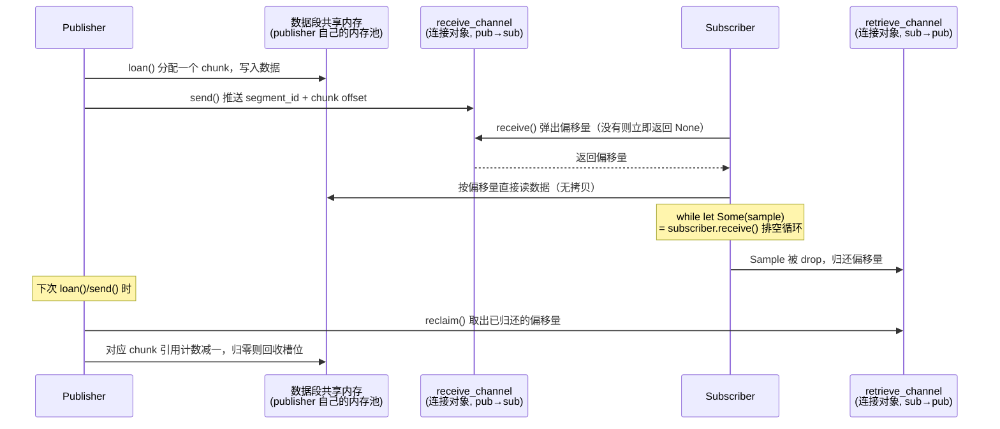
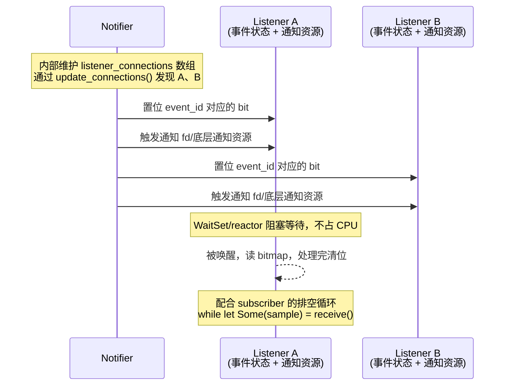
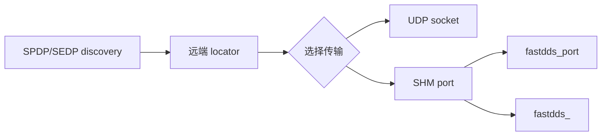
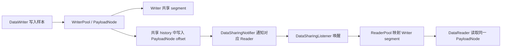

[TOC]
# 基于服务发现的通信中间件

通信端点可以通过服务名、Topic、消息模式或类型信息描述自身能力，其他端点再通过相同的标识发现并建立连接。这样不需要预先写死端到端地址，通信双方可以动态加入和退出。发现信息既可以保存在逻辑中心化的注册中心，也可以通过组播、Gossip 或本机共享元数据在节点间直接传播，因此“维护一份中心注册表”并不是所有通信中间件的共同前提。

## 中心化的服务发现

最直接的方式是通过中心节点实现服务发现。中心节点维护服务注册表，服务端启动时注册自己的服务信息，客户端启动时查询服务地址。注册信息通常还需要配合心跳或 TTL，避免服务退出后注册表中长期保留失效地址。

这种方式实现简单，服务注册和查询的职责也比较清晰，但中心节点本身成为系统的关键依赖。中心节点故障时，服务端无法注册，客户端也无法发现新的服务；因此还需要为中心节点提供高可用部署、故障转移和数据持久化能力。

## 基于高可用注册中心的服务发现

注册中心可以通过多个节点组成一致性集群，消除单个服务器的故障点。这里的“多节点”指注册表服务自身采用复制和选主实现高可用；从客户端视角看，它仍然是一个逻辑中心化的注册中心，并不等同于节点之间直接互相发现的无中心架构。

### etcd

etcd 是一个强一致性的分布式键值存储，也可以用作服务注册中心。服务实例可以申请带 TTL 的 lease，将自己的服务地址写入与 lease 关联的键，并在进程存活期间持续续约；lease 过期后，关联的键会被删除。客户端可以通过 watch 监听某个键或前缀的变化，从而在服务上线、下线或地址变化时更新本地缓存，而不必持续轮询。

etcd 使用 Raft 同时完成 leader 选举和日志复制，注册表数据会在集群成员之间复制。需要达成共识的更新必须由多数成员确认，因此集群失去多数派时不能继续提交新的写入。客户端通过配置的 etcd 成员地址访问集群，不需要使用组播，也不需要另外实现集群间的注册表同步。需要注意的是，lease 只能反映服务实例仍能续约，不能替代应用层的健康检查。

### BestUO::Raft

[BestUO::Raft](https://github.com/BestUO/littletools/tree/master/tools/raft) 实现的是一种受 Raft 启发的 leader election，而不是完整的 Raft 共识算法。它只处理 `HEARTBEAT`、`VOTE` 和 `VOTERESPONSE` 三类实际会被 `HandleData()` 分发的消息；没有实现日志复制、日志一致性检查、`commitIndex` 和成员变更等完整 Raft 所需的机制。

节点通过 UDP 组播通信，默认组播地址为 `234.56.78.90:9987`。每个节点创建一个临时端口的普通 UDP socket 用于发送，同时创建一个开启地址复用的组播 socket 接收消息；节点之间不维护单独的 peer 地址列表。节点状态包括 `FOLLOWER`、代码中拼写为 `CANDICATE` 的候选者，以及 `LEADER`。心跳超时后，节点增加 term、切换为候选者并通过组播发送投票请求；收到超过 `cluster_size / 2` 的同 term 赞成票后成为 leader，并按 heartbeat interval 周期发送心跳。


```mermaid
flowchart TD
    A[启动 Raft] --> B[初始化 UDP socket 和组播地址]
    B --> C[FOLLOWER]
    C --> D{3 × heartbeat_interval 内收到心跳?}
    D -->|是| C
    D -->|否| E[CANDICATE<br/>term 加一]
    E --> F[组播发送 VOTE]
    F --> G{赞成票 > cluster_size / 2?}
    G -->|否| E
    G -->|是| H[LEADER]
    H --> I[周期性组播 HEARTBEAT]
    H --> J{收到更高 term或同term的更大uuid}
    J -->|是| C
    J -->|否| H
    E --> K{收到更高 term?}
    K -->|是| C
    K -->|否| E
```

实现中的选举超时是 `3 * heartbeat_interval`，第一次检查还会增加 `0` 到 `99` 毫秒的随机值，之后的定时周期是固定的。默认 heartbeat interval 为 500 毫秒，而测试用例配置的是 100 毫秒；测试中 10 个节点同时启动可在 500 ms 内选出一个 leader，但这是特定网络和调度条件下的观测结果，不是协议保证。集群总大小来自静态配置的 `cluster_size`，不是通过成员发现动态计算的。

该实现还包含一项非标准 Raft 的冲突处理：同一 term 下两个节点都认为自己是 leader 时，通过比较 UUID 让较大的 UUID 保留 leader 角色，以帮助实现尽快收敛。该规则不能替代标准 Raft 对选举和日志安全性的约束。集成节点启动网络事件循环和 `Raft` 后，可以通过 `Raft::GetRole()` 判断自身角色，再决定是否响应服务注册与发现请求。

## 无中心的服务发现

无中心发现不依赖一个逻辑注册中心。各节点通过组播、广播、Gossip，或者访问共同约定的本机文件和共享内存命名空间交换发现信息。DDS 的 SPDP/SEDP 和下文 iceoryx2 的本机资源发现属于这一类。它可以避免注册中心依赖，但每个参与者都要处理成员变化、陈旧资源、并发创建以及信息最终收敛等问题。

### iceoryx2
#### 目录结构
```
tree /dev/shm /tmp/iceoryx2/
/dev/shm
├── iox2_0354a209029e7d094a819e2d4030ea331e6caaf0_167669731193451374734757469259.data
├── iox2_305ad9523c6b202364d581359ec3d2c5743e42e7_88296412615130078134054034507.dynamic
├── iox2_9204dd183d1c4d8e1ff592a30766ffa6765aa8b5_node.0_9_999.global_mgmt
└── iox2_b9fc73e5c1f646968758453273c6c65cb372831b_167669731193451374734757469259_174204583234706370817156062600.connection
/tmp/iceoryx2/
├── nodes
│   ├── 2597821165922259659259324247710795
│   │   ├── iox2_167669731193451374734757469259.port_tag
│   │   ├── iox2_4eacadf2695a3f4b2eb95485759246ce1a2aa906.service_tag
│   │   └── iox2_node.details
│   ├── 2597906899854434788489543204085128
│   │   ├── iox2_174204583234706370817156062600.port_tag
│   │   ├── iox2_4eacadf2695a3f4b2eb95485759246ce1a2aa906.service_tag
│   │   └── iox2_node.details
│   ├── iox2_2597821165922259659259324247710795.node_monitor
│   ├── iox2_2597821165922259659259324247710795.node_monitor_context
│   ├── iox2_2597821165922259659259324247710795.node_monitor_owner_lock
│   ├── iox2_2597906899854434788489543204085128.node_monitor
│   ├── iox2_2597906899854434788489543204085128.node_monitor_context
│   └── iox2_2597906899854434788489543204085128.node_monitor_owner_lock
└── services
    └── iox2_4eacadf2695a3f4b2eb95485759246ce1a2aa906.service
```

* .global_mgmt: 
```rust
Data<State> {
    version: AtomicU64,  // PackageVersion::get().to_u64()
    data: State,
}
```

* iox2_node.details: 节点信息
* .node_monitor: 原进程持有的文件锁，生命周期和原node一致。只表征node存活状态
* .node_monitor_context: 存放unique_process_id，统一进程不同node的unique_process_id相同
* .node_monitor_owner_lock: 清理node资源的文件锁。谁拥有这个文件锁，谁就能清理原进程资源。只表征清理权
* .dynamic: 文件名由`iceoryx2::service::dynamic_config::DynamicConfig`+`UniqueSystemId`组成。第二个程序通过`.service`文件查看`UniqueSystemId`，打开`.dynamic`文件，修改`DynamicConfig`数据，添加`nodes`和`messaging_pattern`信息。`service.publisher_builder().create()`时会把port_id加入到`messaging_pattern`对应的`PublishSubscribe`信息中。
```rust
pub(crate) enum MessagingPattern {
    RequestResponse(request_response::DynamicConfig),
    PublishSubscribe(publish_subscribe::DynamicConfig),
    Event(event::DynamicConfig),
    Blackboard(blackboard::DynamicConfig),
}
pub struct UniqueSystemId {
    pid: u32,
    seconds: u32,
    nanoseconds: u32,
    counter: u32,
}
pub struct UniqueNodeId(pub(crate) UniqueSystemId);
pub struct Container<T: Copy + Debug> {
    // must be first member, otherwise the offset calculations fail
    element_generation_counter_ptr: RelocatablePointer<AtomicU64>,
    data_ptr: RelocatablePointer<UnsafeCell<MaybeUninit<T>>>,
    capacity: usize,
    change_counter: AtomicU64,
    is_initialized: AtomicBool,
    container_id: UniqueId,
    // must be the last member, since it is a relocatable container as well and then the offset
    // calculations would again fail
    index_set: RobustUniqueIndexSet,
}
pub struct DynamicConfig {
    messaging_pattern: MessagingPattern,
    nodes: Container<UniqueNodeId>,
}
```

* .service_tag:以`service_hash(messaging_pattern+service_name)`为文件名, 每个文件都标记node使用过的一个service，供死亡节点清理
* .service: `create_static_config_storage`创建，存储service相关基本信息
* .port_tag: 以端口的 UniqueId 命名，标记一个端口的生命周期。节点挂掉后，清理方通过 `port_tag` 找到对应端口，并根据端口类型清理 incoming/outgoing connection、数据段、事件资源以及 tag 本身；它不是简单地“一份 tag 对应删除一份 `.data`”。
* .data: 文件名由 内部类型+`port_id`组成,真正存数据的地方
* .connection: 文件名由内部类型+`sender_port_id_receiver_port_id`组成。`service.publisher_builder().create()`或`service.subscriber_builder().create()`时，检索`.dynamic`中的对端列表再执行`create_sender()`或者`create_receiver()`。两端针对同一个确定性名称执行 create-or-open，先到的一方可能完成共享内存初始化，另一方打开并校验已有对象。`.connection`存放`SharedManagementData`结构体，`channels`中维护发送队列和归还队列；send 时向发送队列推送 offset，subscriber 消费完再向归还队列发送回收信息。
```rust
pub struct SharedManagementData {
    channels: RelocatableVec<Channel>,
    segment_details: RelocatableVec<SegmentDetails>,
    state: AtomicU8,
    max_borrowed_samples: usize,
    number_of_samples_per_segment: usize,
    number_of_segments: u8,
    enable_safe_overflow: bool,
}
```

#### 服务发现

> 这里的 iceoryx2 章节讨论的是 iceoryx2 的本机/跨进程 IPC，不是基于 TCP/UDP 的网络分布式中间件。默认的 `ipc::Service` 使用 POSIX 相关机制和共享内存；`local::Service` 只限当前进程；`*_threadsafe::Service` 决定端口对象能否安全地在线程间共享。不同进程的节点通过文件、共享内存对象和文件描述符通知机制协作，不经过中心 daemon。


```mermaid
graph TB
  ROOT["global.root-path<br/>默认 /tmp/iceoryx2"]

  subgraph NODE["global.node.directory 节点目录（按 UniqueNodeId 命名）"]
    N1["&lt;node_id&gt;/iox2_node.details<br/>NodeDetails: executable / name / config"]
    N2["iox2_&lt;node_id&gt;.node_monitor*<br/>ProcessGuard/monitor 相关文件"]
    N3["&lt;node_id&gt;/iox2_&lt;service_hash&gt;.service_tag<br/>该 node 的 service 反向索引"]
    N4["&lt;node_id&gt;/iox2_&lt;port_id&gt;.port_tag<br/>端口生命周期标记"]
  end

  subgraph SVC["global.service.directory 服务目录（按 topic+MessagingPattern 哈希命名）"]
    S1["iox2_&lt;service_hash&gt;.service<br/>StaticConfig：服务描述和类型信息"]
    S2["iox2_&lt;unique_service_id&gt;.dynamic<br/>DynamicConfig：运行时管理状态"]
    S3["数据段/连接/事件资源<br/>实际 payload chunk 和通知资源"]
  end

  subgraph CONN["连接对象（独立命名空间，按 sender_id+receiver_id 命名，由两端 create-or-open）"]
    C1["receive_channel<br/>pub → sub 方向：推送 chunk 偏移量"]
    C2["retrieve_channel<br/>sub → pub 方向：归还已消费的偏移量"]
  end

  ROOT --> NODE
  ROOT --> SVC
  N3 -.引用 ServiceId.-> S1
  S2 -.发现对端后.-> CONN
  S3 -.承载数据与通知.-> CONN
```

**Node 目录**(`global.node.directory`,全局唯一、按 `UniqueNodeId` 命名,和具体 service 无关):

- **节点详情**(`NodeDetails`):节点基本信息,包含 `executable`(可执行文件名)、`name`(用户节点名)、`config`(该节点使用的配置)。它由 `NodeBuilder::create()` 序列化到 `iox2_node.details`，不是 payload 共享内存。
- **文件监控锁**:由 `ProcessGuard` 创建 state/context/owner-lock 等文件，并对 state file 持有进程关联的写锁。进程崩溃时，操作系统关闭文件描述符并释放锁；文件本身不会自动删除。其他进程通过 `ProcessMonitor` 判断 `Alive`/`Dead`/`DoesNotExist`，而不是依赖 PID。`ProcessCleaner` 取得 owner lock 后才有权清理 dead node，避免多个进程同时清理。
- **service_tag/port_tag**:分别是 node 与 service、node 与 port 的生命周期标记。它们提供反向索引，使 dead-node cleanup 可以找到关联资源，而不必扫描所有服务。

**Service 目录**(`global.service.directory`,按 `服务名 + MessagingPattern` 哈希命名):

- **静态配置**:服务描述(类型信息、QoS/资源限制、`MessageTypeDetails` 等)。`open_or_create()` 的第一个成功创建者用 `O_CREAT|O_EXCL` 创建并写入，后来者打开并校验；它是初始化后只读的配置文件。
- **动态配置**:由 `DynamicStorage<DynamicConfig>` 提供的共享管理区域，保存节点注册、publisher/subscriber 或 notifier/listener 的运行时管理信息。它不是简单地“无锁并发读写”：内部包含原子状态、可重定位容器、分配器和具体同步策略；具体端口和 service 类型还会影响线程安全策略。
- **数据与连接资源**:`.service`/`.dynamic` 不是 payload 本身。publish-subscribe 的实际 chunk 位于数据段；sender/receiver connection 和 event/notification 资源负责传递偏移量、回收信息和唤醒等待者。

**初始化与并发创建**(不是把整个写入过程做成一个原子操作):

1. 创建阶段用 `O_CREAT | O_EXCL` 保证同一时刻只有一个进程能创建成功,解决"谁来写"的互斥问题。
2. 用初始化状态协议发布“可读取”:
   - 静态 storage 先以 `INIT_PERMISSIONS` 创建，写入内容并 `sync_all()` 后切换到 `FINAL_PERMISSIONS`。
   - file dynamic storage 先创建并 `truncate`/`mmap`，把 `Data<T>::version` 设为 0；initializer 完成后以 `SeqCst` 写入当前 package version，再切换到最终权限。
   - 打开方在权限仍是初始化状态、文件大小为 0、或 dynamic version 为 0 时等待；超时返回 `InitializationNotYetFinalized`。因此同步依靠“独占创建 + 完成标志 + 打开方等待”，不是依靠 `open`、`truncate`、`mmap`、业务写入本身的原子性。
3. 如果创建方在初始化中崩溃，monitor token 对应的 `ProcessGuard` 会因操作系统关闭文件描述符而释放锁；其他 node 通过 `ProcessMonitor` 发现 `Dead`，取得 `ProcessCleaner` 后清理 stale resources。`FINAL_PERMISSIONS` 只代表 storage 初始化完成，不代表进程存活。

**连接对象**(独立于 node/service 目录的第三类资源):

- pub/sub 场景下，每一对 (publisher, subscriber) 有独立的连接共享内存，内部紧挨着放 `receive_channel` + `retrieve_channel`。Publisher 的 `create_sender()` 和 Subscriber 的 `create_receiver()` 都会按 `sender_id + receiver_id` 算出同一个名字并执行 create-or-open：先到的一方负责初始化，另一方打开后校验容量等配置。双方也会在后续 API 活动中通过 `update_connections()` 发现动态加入的对端。

#### Publisher/Subscriber 模式(数据面，零拷贝 + 通知/轮询两种使用方式)

```mermaid
sequenceDiagram
  participant P as Publisher
  participant D as 数据段共享内存<br/>(publisher 自己的内存池)
  participant Rc as receive_channel<br/>(连接对象, pub→sub)
  participant S as Subscriber
  participant Rt as retrieve_channel<br/>(连接对象, sub→pub)

  P->>D: loan() 分配一个 chunk，写入数据
  P->>Rc: send() 推送 segment_id + chunk offset
  S->>Rc: receive() 弹出偏移量（没有则立即返回 None）
  Rc-->>S: 返回偏移量
  S->>D: 按偏移量直接读数据（无拷贝）
  Note over S: while let Some(sample)<br/>= subscriber.receive() 排空循环
  S->>Rt: Sample 被 drop，归还偏移量
  Note over P: 下次 loan()/send() 时
  P->>Rt: reclaim() 取出已归还的偏移量
  P->>D: 对应 chunk 引用计数减一，归零则回收槽位
```

- publisher 往自己的数据段共享内存里写数据，把这个 chunk 的 **segment_id + offset** 推进对应 subscriber 连接里的 `receive_channel`。跨进程传递的不是虚拟地址，因为同一共享内存在各进程中的映射地址可以不同。
- subscriber 从 `receive_channel` 弹出偏移量，再去数据段里读实际数据；`subscriber.receive()` 是非阻塞的，没有数据立即返回 `None`。如果应用只在 `node.wait()` 后调用 `receive()`，就是周期性轮询。Publish-subscribe 端口本身不会自动产生 Listener 事件；若要事件驱动，应用需要另建 Event 服务，Publisher 在发送数据后显式调用 Notifier，Subscriber 侧的 Listener/WaitSet 被唤醒后再排空 receive 队列。通知通路与数据通路彼此独立，应用需要自行定义两者的顺序和容错语义。
- subscriber 用完一个样本(`Sample` 被 drop)后,把这个偏移量推进同一条连接的 `retrieve_channel`。
- publisher 在需要分配新 chunk 时(`loan`/`send` 内部)顺带处理 `retrieve_channel`:弹出偏移量,把对应 **chunk** 的引用计数减一,归零后这个**槽位**被回收复用——这是常规定长消息下的粒度,不涉及删除整个共享内存文件。

这里的“零拷贝”需要满足边界条件：使用 `loan()` 获得共享内存中的 chunk 并原地构造 payload，才不会先从应用私有内存复制到共享内存；`send_copy()` 仍会执行这一次复制。Payload 还必须是可跨进程解释的自包含数据布局，不能直接包含指向发送进程私有地址空间的普通 `String`、`Vec`、裸指针或引用。对可变长数据，通常需要在 loaned chunk 内使用经过支持的动态类型或序列化布局。

iceoryx2 默认不依靠后台线程持续刷新连接。新端口发现、归还队列处理和新 segment 映射通常由后续 API 调用推进，因此发送端在发送后立即析构、或者在接收端尚未映射新 segment 前销毁相关资源，都可能使尚未建立完整连接的样本无法到达。应用应让端口生命周期覆盖消息实际消费阶段。

#### Notify/Listen 模式(控制面，事件状态 + 可等待通知)

```mermaid
sequenceDiagram
  participant N as Notifier
  participant L1 as Listener A<br/>(事件状态 + 通知资源)
  participant L2 as Listener B<br/>(事件状态 + 通知资源)

  Note over N: 内部维护 listener_connections 数组<br/>通过 update_connections() 发现 A、B
  N->>L1: 置位 event_id 对应的 bit
  N->>L1: 触发通知 fd/底层通知资源
  N->>L2: 置位 event_id 对应的 bit
  N->>L2: 触发通知 fd/底层通知资源
  Note over L1: WaitSet/reactor 阻塞等待，不占 CPU
  L1-->>L1: 被唤醒，读 bitmap，处理完清位
  Note over L1: 配合 subscriber 的排空循环<br/>while let Some(sample) = receive()
```

- `EventId` 是应用双方提前约定好的整数,数值本身就是位图下标,不存在冲突问题,只要不超过建 service 时配置的 `event_id_max_value` 上限。
- Notifier 内部维护到已知 Listener 的连接，并向每个 Listener 的事件状态和通知资源发送通知。具体底层机制由 `Service::Event`/CAL backend 决定，不应在通用架构描述中固定为“每个 Listener 一张 bitmap + 一个 semaphore”。
- 如果使用 `WaitSet`，应用不需要自己维护 bitmap 或 semaphore：Listener/文件描述符被 attach 到 `Service::Reactor`，Linux 通常使用 epoll，其他 backend 可使用 select 等机制；WaitSet 通过 attachment id 回调应用。
- 通知只负责唤醒和报告事件状态，不等于替代数据面队列。publish-subscribe 收到唤醒后仍应排空 `subscriber.receive()`；具体事件是否合并、是否丢失以及事件语义由 Event/Listener 的实现和 API 契约决定，不能笼统保证“信号量计数 + bitmap 一定不会丢数据”。

#### WaitSet：统一等待多个事件源

`WaitSet` 是 reactor 封装，不是另一套消息队列。创建时建立 `Service::Reactor` 和 deadline queue；attach 时把 Listener 或实现 `FileDescriptorBased`/`SynchronousMultiplexing` 的对象注册到底层 reactor。Linux backend 使用 epoll，select backend 使用 `FileDescriptorSet`。

```rust
let waitset = WaitSetBuilder::new().create::<ipc::Service>()?;
let guard = waitset.attach_notification(&listener)?;

waitset.wait_and_process(|attachment_id| {
    if attachment_id.has_event_from(&guard) {
        let _ = listener.try_wait(|event| {
            // process event activation
            let _ = event;
        });
    }
    CallbackProgression::Continue
})?;
```

attachment 由 `WaitSetGuard` 持有，guard drop 时自动 detach。WaitSet 还支持 interval、deadline 和超时等待；deadline 到期与 fd 就绪分别生成不同的 attachment 状态。

#### 线程安全 service 类型

`ipc::Service` 和 `ipc_threadsafe::Service` 都使用跨进程 IPC 资源，区别在进程内端口对象的线程安全策略：前者使用 `SingleThreaded`，后者使用 `MutexProtected`，后者会增加锁开销但使端口可以安全地在线程间共享。`local`/`local_threadsafe` 是对应的进程内变体。

#### 可变长消息

- 底层通过 `ResizableSharedMemory` 支持:数据段不是单一固定大小的共享内存,而是由若干个按需追加的 segment(每个有自己的 `SegmentId`)拼成的池子。
- **绝大多数消息复用现有 segment**。当现有 segment 无法满足分配请求时，ResizableSharedMemory 会结合 allocator 的 resize hint 和配置的 `AllocationStrategy` 决定是否创建新的、更大 segment；因此触发条件不只是“单条消息尺寸超过所有 segment”。
- 旧 segment 在里面所有 chunk 都被回收之前不会被销毁;subscriber 收到指向"没见过的新 segment"的偏移量时,需要先额外 `mmap` 一次这个新 segment 才能读数据。
- 这套机制有次数上限(`SegmentId` 的取值范围是有限的),适合"消息大小阶段性变化但整体有界"的场景,不适合每条消息大小都剧烈抖动的场景。

### FastDDS
Fast DDS 的 SHM transport 仍然使用 DDS/RTPS discovery。Participant 通过 SPDP 发布 locator，endpoint 通过 SEDP 发布 locator；接收方据此判断远端 locator 是否可达，并选择 UDP、SHM 等传输。

需要区分两件事：SHM transport 的 locator 是 `LOCATOR_KIND_SHM`，而 Data-sharing 是另一套共享内存数据面机制。抓包中的 UDP locator 只能说明该 discovery 数据发布了 UDP 地址，不能据此推断所有用户数据都经过 UDP；反过来，看到 `/dev/shm/fastdds_*` 也只能证明 SHM transport 创建了资源，是否发送某条 RTPS 消息还要看最终选择的 locator 和 `SharedMemTransport::send()` 路径。


```mermaid
flowchart LR
    D[SPDP/SEDP discovery] --> L[远端 locator]
    L --> S{选择传输}
    S --> U[UDP socket]
    S --> H[SHM port]
    H --> P[fastdds_port<port>]
    H --> M[fastdds_<segment_id>]
```

#### Locator 和传输选择

`SharedMemTransportDescriptor::create_transport()` 创建 `SharedMemTransport`。SHM locator 由 `SHMLocator::create_locator()` 生成：

```text
Locator.kind    = LOCATOR_KIND_SHM
Locator.port    = SHM port 编号
Locator.address = 本机 host id 和 locator 类型信息
```

SPDP 中的 `PID_DEFAULT_UNICAST_LOCATOR` 和 SEDP 中的 endpoint locator 都是 discovery 元数据，不是实际的共享内存文件名。`SharedMemTransport::transform_remote_locator()` 只接受已经是 `LOCATOR_KIND_SHM` 的 locator，不会把 UDP locator 转换成 SHM locator。

当 locator 选择结果中包含 SHM locator 时，发送路径大致如下：

```text
SharedMemTransport::send()
  -> copy_to_shared_buffer()
  -> shared_mem_segment_->alloc_buffer(total_bytes, ...)
  -> memcpy(RTPS message, buffer)
  -> find_port(remote_locator.port)
  -> port->try_push(BufferDescriptor)
```

#### Payload segment：`fastdds_<segment_id>`
`/dev/shm/fastdds_32cc0a6c8f6f1cf1`的命名规则是：`<domain_name>_<segment_id>`。内置 domain name 是 `fastdds`，`segment_id` 是随机生成的 8 字节 ID，以 16 个十六进制字符显示。每个已初始化的 `SharedMemTransport` 创建自己的发送 segment；默认 Participant 配置通常只有一个 SHM transport，所以观察上经常表现为“每个 Participant 一个 segment”，但两者不是语义上的严格一一对应。复用同一个 transport 的多个 topic 和 endpoint 可以共用这个 segment。`fastdds_<segment_id>`文件中存放`SharedMemManager::BufferNode`以及动态分配的 RTPS payload。
```C++
    struct BufferNode
    {
        struct Status
        {
            uint64_t validity_id : 24;
            uint64_t enqueued_count : 20;
            uint64_t processing_count : 20;
        };

        std::atomic<Status> status;
        uint32_t data_size;
        SharedMemSegment::Offset data_offset;
    }
```

SHM transport发送一条 RTPS 消息时，根据序列化后的实际字节数动态分配 buffer,然后填充一条`BufferNode` 记录：
```text
shared_mem_segment_->alloc_buffer(total_bytes, ...);
    ->segment_->get().allocate(size);

对应的 `BufferNode` 记录：
data_offset  -> payload 在 segment 中的偏移
data_size    -> payload 大小
status       -> validity/enqueued/processing 计数
```

segment 总大小在 transport 初始化时固定，不会因为单条消息变大而自动扩容。分配失败时，Fast DDS 会先尝试回收不再引用或没有 listener 正在处理的旧 buffer；仍然不足则报告 allocation overflow。配置上，segment 至少应能容纳最大单次 RTPS transport message，并且还要为同时存活的其他消息预留空间。

#### Port segment：`fastdds_port<port>`
`/dev/shm/fastdds_port7411` 的命名规则是：`<domain_name>_port<port_id>`。它不保存完整 RTPS payload，而是保存跨进程的描述符队列和同步状态。核心类型包括：
```cpp
SharedMemGlobal::PortNode 
SharedMemGlobal::BufferDescriptor
MultiProducerConsumerRingBuffer<BufferDescriptor>
```

`PortNode` 包含 port 状态、监听者数量、`ListenerStatus[1024]`、条件变量、互斥量和 domain name。环形队列中的 `BufferDescriptor` 告诉接收进程应该打开哪个 `fastdds_<segment_id>`，并在其中按哪个 offset 找到 `BufferNode` 和 payload，因此实际数据面是：
```text
发送进程：payload 写入 fastdds_<segment_id>
发送进程：BufferDescriptor 写入 fastdds_port<port_id>
接收进程：从 port 读取 descriptor
接收进程：open_only(fastdds_<segment_id>)
接收进程：按 offset 读取 payload
```

#### `_el` 文件和 `sem.*` 对象
`fastdds_<segment_id>_el` 是 segment 所有权/存活性使用的 robust exclusive lock。Port 的 `_el` 表示独占 reader lock，`_sl` 则用于 shared reader lock；判断资源是否为 zombie 不能只看锁文件是否存在，还要尝试获取锁并判断它是否仍被活跃进程持有。

`sem.*` 是 `RobustInterprocessCondition` 为跨进程条件等待建立的 semaphore 对象，用于阻塞和唤醒 listener，并不负责保证“同一时刻只有一个进程访问整个 segment 或 port”。多个进程本来就可以同时映射 payload segment；PortNode 中的 mutex、原子状态和 `MultiProducerConsumerRingBuffer` 协议共同负责并发协调。当前实现中 Port 自己维护 `ListenerStatus[1024]`，而 `RobustInterprocessCondition` 内部 semaphore pool 的上限是另一个实现常量，不能把两者视为同一个数组。

#### Data-sharing：直接共享 Writer History

Data-sharing 与 SHM Transport 是两条不同的数据路径。SHM Transport 仍然传送完整的 RTPS message：发送方把序列化后的 RTPS 字节复制到 `fastdds_<segment_id>`，再把 `BufferDescriptor` 推入远端 Port。Data-sharing 则跳过本机 Reader/Writer 之间的 RTPS transport 数据传输，让 Reader 直接映射 Writer 的共享 history。


```mermaid
flowchart LR
    A[DataWriter 写入样本] --> B[WriterPool / PayloadNode]
    B --> C[Writer 共享 segment]
    B --> D[共享 history 中写入 PayloadNode offset]
    D --> E[DataSharingNotifier 通知对应 Reader]
    E --> F[DataSharingListener 唤醒]
    F --> G[ReaderPool 映射 Writer segment]
    G --> H[DataReader 读取同一 PayloadNode]
```

每个启用 Data-sharing 的 Writer 创建一块以 Writer GUID 命名的共享 segment。segment 中主要包含：

- 预分配的 `PayloadNode` 池，每个节点保存样本元数据和序列化 payload；
- 一个保存 `PayloadNode` offset 的共享 history 环形区域；
- `PoolDescriptor`，维护 history 的 begin/end 和 liveliness 状态。

Reader 匹配到兼容 Writer 后，以只读角色打开该 Writer 的 segment，并用 `ReaderPool` 将共享内存中的 offset 转为本进程可访问的地址。每个 Reader 还创建自己的 `fast_datasharing_<reader_guid>` 通知 segment，里面包含 condition variable、mutex 和 `new_data` 标志；Writer 的 `DataSharingNotifier` 打开该通知对象，Writer history 出现新数据时唤醒 Reader 的 `DataSharingListener`。通知只表示“可能有新数据”，实际样本顺序和可见范围仍由 Writer 的共享 history 决定。

##### Data-sharing 是否等于端到端零拷贝

Data-sharing 避免了 Writer 到本机 Reader 之间的 transport copy，但是否达到应用到应用的零拷贝，还取决于 API 和类型：

- 普通 `DataWriter::write()` 通常仍需把用户对象序列化到 WriterPool 的共享 payload；
- 对满足 loan 要求的 plain/bounded 类型，Writer 使用 `loan_sample()` 直接在共享 payload 中构造数据，Reader 再通过 loaned sample 读取，可以避免应用层的额外复制；
- 非 plain 类型在 Reader 侧可能仍需反序列化为用户对象，因此“使用 Data-sharing”不能直接等价为“必然零拷贝”。

Data-sharing 只有在双方 QoS 和实现约束兼容时才启用。当前 Writer 侧的主要限制包括：类型必须 bounded、不能是 keyed type、history memory policy 必须是 `PREALLOCATED_MEMORY_MODE` 或 `PREALLOCATED_WITH_REALLOC_MEMORY_MODE`，不能使用自定义 payload pool，也不能与启用的安全保护组合使用。Writer 和 Reader 的 Data-sharing domain ID 还必须存在交集。

`DataSharingQosPolicy` 的三种模式语义不同：

- `AUTO`：条件满足时使用 Data-sharing，否则仍可使用普通 transport；
- `ON`：要求本地 endpoint 按 Data-sharing 的约束创建；本地类型、memory policy 或安全配置不兼容时创建失败。某个远端 Writer/Reader 是否实际走 Data-sharing，仍取决于双方 domain ID 等匹配条件；
- `OFF`：禁用 Data-sharing。

因此，判断 Fast DDS 本机通信的真实数据路径时，需要同时检查 transport locator、Data-sharing QoS、类型与 memory policy，以及 Writer/Reader 是否最终建立了 Data-sharing 匹配。仅查看 UDP 抓包或 `/dev/shm/fastdds_*` 文件都不足以单独下结论。
